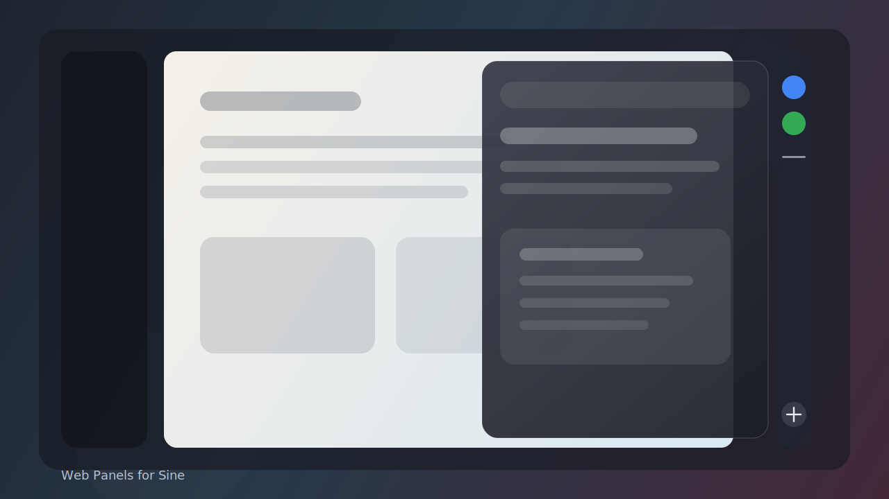

# Web Panels for Sine

Web Panels is a Sine mod that adds a temporary web-app panel rail to Firefox-family browsers, optimized for Zen Browser first.

The saved Zen Browser implementation is only a reference. This repository is a standalone Sine mod using `theme.json`, `userChrome.css`, and userChromeJS modules.



## Features

- Persistent web panel URLs stored in `sine.web-panels.items`.
- Favicon rail with a bottom `+` button.
- URL-only add/edit popup with validation for `http` and `https`.
- Tab context-menu action to add the clicked web tab to Web Panels.
- Floating panel surface that opens above the page without resizing it.
- Outside-click and Escape dismissal.
- Resizable panel with a `320px` minimum width.
- Panel context menu: open in new tab, edit, move, unload, delete.
- Empty rail context menu: add new web panel.
- Drag reorder across panels.
- Unread count badge from title prefixes such as `(3) Inbox` or `[3] Inbox`.
- Clean Sine unload handling for DOM, listeners, and live panel browsers.

## Install

1. Install Sine for your browser.
2. Open Sine Mods in browser settings.
3. Add this repository as a custom/unpublished mod.
4. Enable unsafe JavaScript if Sine requires it for local mods.
5. Restart the browser if Sine does not hot-load chrome scripts.

The mod is designed for Zen Browser first. It should load in Firefox-family browsers that support Sine chrome JavaScript, but non-Zen layouts may need additional styling validation.

## Preferences

- `sine.web-panels.enabled`: enables or disables the rail.
- `sine.web-panels.compact`: collapses the rail to a 0px hot zone at the screen edge; hover expands it, leaving the panel area collapses it back.
- `sine.web-panels.width`: remembered floating panel width.
- `sine.web-panels.items`: JSON list of panel and separator items.

## Validate

Run the static package checks before publishing:

```bash
node scripts/validate-package.mjs
git diff --check
```

Manual browser checks:

- Install through Sine as a custom mod.
- Confirm the rail appears and reserves viewport space.
- Add a URL with the `+` button.
- Right-click a web tab and choose `Add to Web Panels`.
- Open, close, resize, unload, reorder, and delete panels.
- Disable the mod and confirm the rail, panel browsers, and listeners unload.

## Screenshots Checklist

- Rail with multiple favicon items.
- Add URL popup.
- Floating panel open above page content.
- Resizing panel.
- Context menu and separator.
